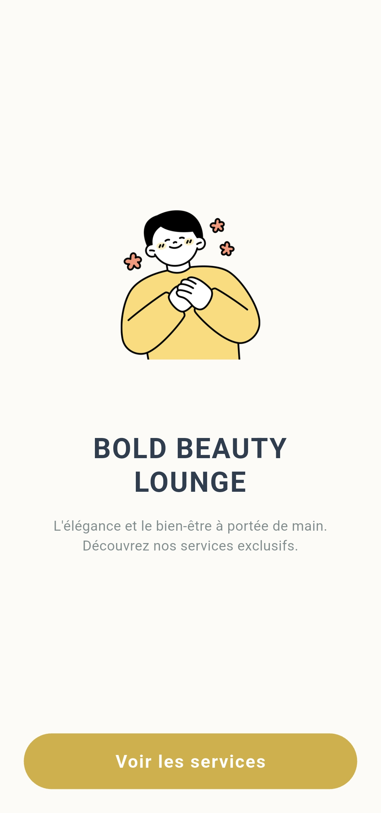
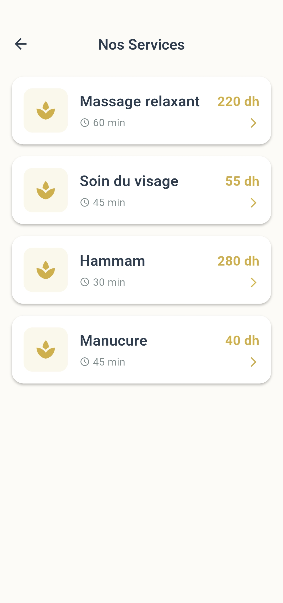
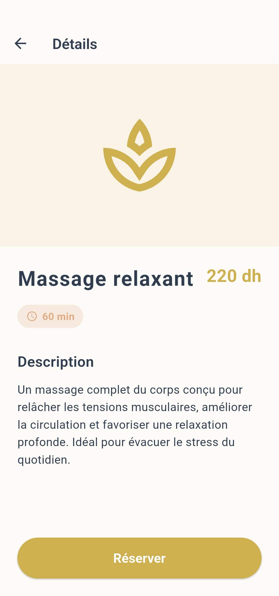
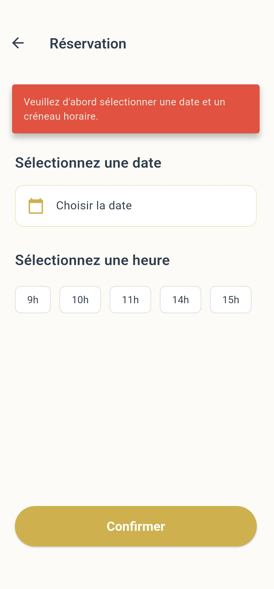
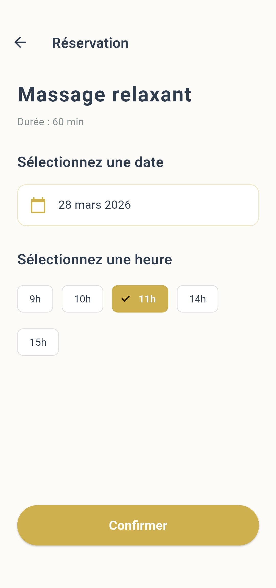
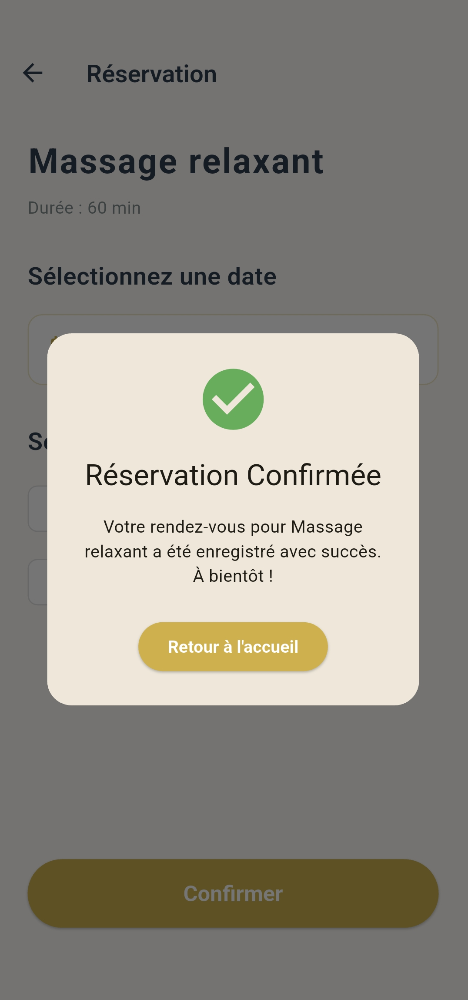

# Bold Beauty Lounge Spa App

A beautiful, functional MVP mobile application for a spa salon built with Flutter and BLoC.

## Overview

"Bold Beauty Lounge" is a mobile application allowing users to discover spa services, view details (description, duration, price), and book appointments by selecting a date and time slot. 

This project demonstrates a clean architecture approach, utilizing the **BLoC pattern** for state management and local mock data, with a focus on a premium, elegant UI/UX suitable for a spa salon.

## Features

*   **View Services:** A list of available spa treatments with an elegant card design.
*   **Service Details:** In-depth information about each service including duration and price.
*   **Booking System:** A functional booking flow with dynamic date selection (using a custom-styled Calendar) and time slot chips.
*   **State Management:** Robust state handling using `flutter_bloc` for loading services, selecting dates/times, and confirming bookings.
*   **Responsive UI:** A premium design system with custom colors and typography defined in a central constants file.

## Project Structure

The codebase is organized cleanly to separate concerns:

```
lib/
├── bloc/           # BLoC state management (Events, States, Bloc logic)
├── models/         # Data models (e.g., ServiceModel)
├── screens/        # UI Views (Home, List, Details, Booking)
├── services/       # Data providers (MockSpaService)
├── utils/          # Global constants, colors, text styles
├── widgets/        # Reusable UI components (ServiceCard)
└── main.dart       # App entry point & provider setup
```

## Technologies & Dependencies

*   **Flutter SDK:** ^3.35.5
*   **flutter_bloc:** For scalable and predictable state management.
*   **equatable:** To simplify value equality in BLoC events and states.
*   **intl:** For formatting dates in the booking calendar (French locale configured).

## Getting Started

### Prerequisites

Ensure you have the Flutter SDK installed on your machine.
- [Install Flutter](https://docs.flutter.dev/get-started/install)

### Installation

1.  Clone the repository or download the source code.
2.  Navigate to the project directory:
    ```bash
    cd salon_de_spa
    ```
3.  Install the dependencies:
    ```bash
    flutter pub get
    ```

### Running the App

Run the application on an emulator or a connected physical device:

```bash
flutter run
```

## Screenshots

<p align="center">
  
  
  
</p>
<p align="center">
  
  
  
</p>

---
*Developed as a Flutter technical showcase.*
